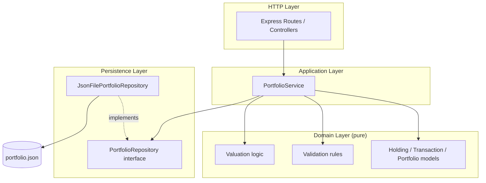
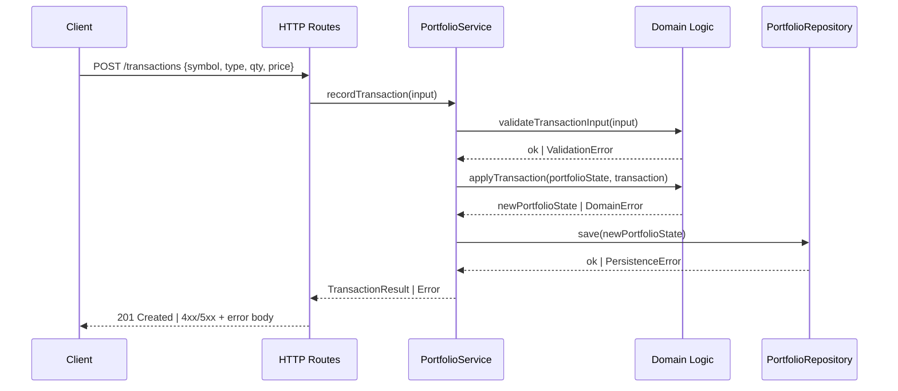
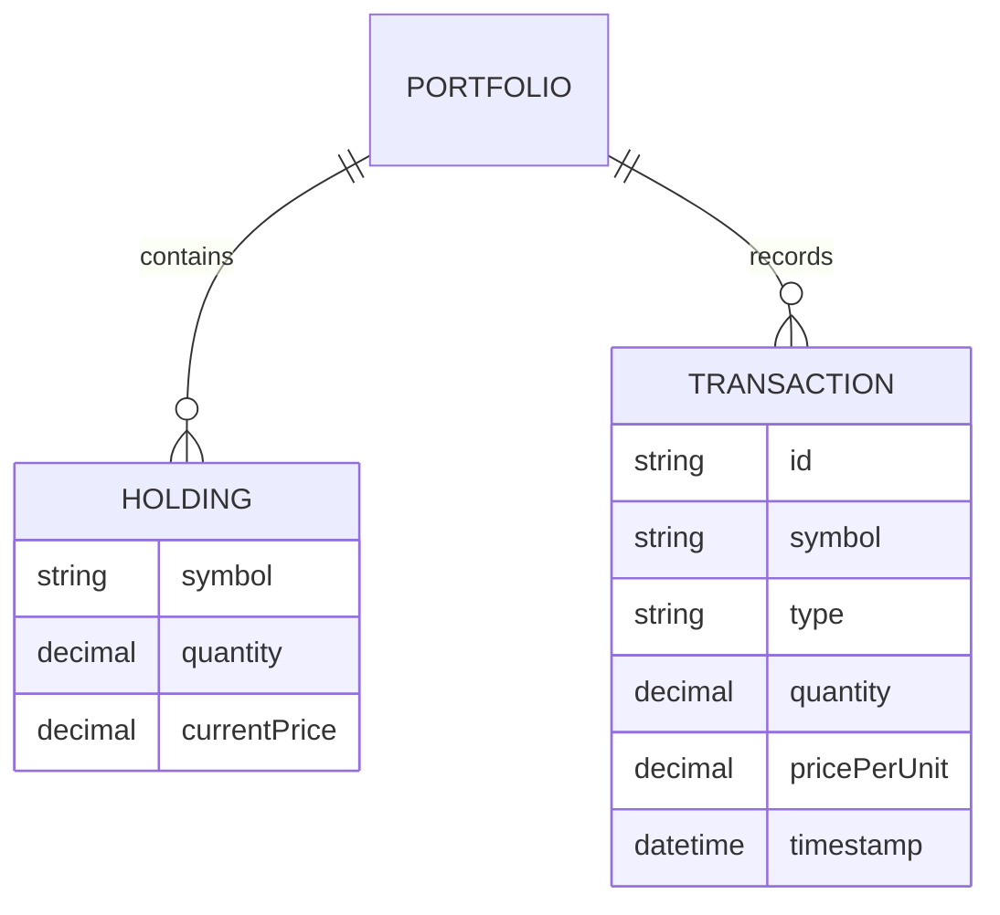

# Design Document

## Overview

This feature implements the core portfolio-management logic for kiro-test: creating and maintaining cryptoasset Holdings, recording Buy/Sell Transactions, viewing the Portfolio overview and value, updating prices, and persisting all of this data across application restarts.

The design favors a small, strictly-layered architecture with a pure, framework-free domain core. All business rules (validation, arithmetic, invariants) live in the domain layer with no dependency on HTTP, storage, or the UI. This keeps the rules easy to unit-test and property-test in isolation, and lets the persistence mechanism or HTTP framework be swapped later without touching business logic — a good reference example of Kiro-recommended separation of concerns.

Key technical decisions:

- **Language/runtime**: TypeScript on Node.js. TypeScript's structural typing and discriminated unions map cleanly onto the domain's validation and error states, and it is a natural fit for a web application reference project.
- **Arbitrary-precision arithmetic**: quantities and prices are stored and computed using a decimal library (`decimal.js`) rather than native `number`, because the requirements demand exact handling of values up to 1,000,000,000,000 with up to 8 decimal places — a range/precision combination that loses accuracy under IEEE-754 floats.
- **Persistence**: a JSON-file-backed repository behind a small `PortfolioRepository` interface. This is enough to satisfy the persistence requirements (survive restarts, atomic all-or-nothing writes) while staying simple and dependency-free; a database-backed implementation could later satisfy the same interface.
- **API surface**: a thin HTTP layer (Express) that translates requests into calls on a single `PortfolioService`, and translates domain results/errors back into HTTP responses. All the interesting logic is in `PortfolioService` and the domain model, not in route handlers.

## Architecture

The system is organized into four layers. Dependencies only point downward (HTTP → Service → Domain, and Service → Repository interface, with the JSON implementation depending on the interface, not the reverse).



**Request flow (example: recording a Sell transaction)**



**Consistency and concurrency**: `PortfolioService` holds the current in-memory `PortfolioState` and serializes all mutating operations (add/update/remove holding, record transaction, update price) through a single async mutex. Each mutating operation: (1) validates input against the in-memory state, (2) computes the new state, (3) persists the new state, and (4) only on successful persistence, swaps it in as the current in-memory state. If persistence fails, the in-memory state is left untouched and the error is surfaced, satisfying Requirement 5.4. This serialization also prevents lost-update races between concurrent requests (e.g., two simultaneous Buy transactions for the same symbol).

## Components and Interfaces

### Domain layer

Pure, synchronous, side-effect-free functions and types. No I/O.

```typescript
// Money/quantity values are represented as Decimal (decimal.js) internally,
// serialized as strings at the API/persistence boundary to avoid precision loss.

type Symbol = string; // 1-10 chars, [A-Z0-9]

interface Holding {
  symbol: Symbol;
  quantity: Decimal;      // > 0, <= 1_000_000_000_000, up to 8 decimals
  currentPrice: Decimal;  // >= 0, <= 1_000_000_000_000, up to 8 decimals
}

type TransactionType = "Buy" | "Sell";

interface Transaction {
  id: string;             // generated identifier
  symbol: Symbol;
  type: TransactionType;
  quantity: Decimal;       // > 0
  pricePerUnit: Decimal;   // >= 0
  timestamp: Date;
}

interface PortfolioState {
  holdings: Map<Symbol, Holding>;
  transactions: Transaction[]; // append-only, all transactions ever recorded
}

// Validation (Requirement 1, 2, 4)
function validateNewHoldingInput(input: NewHoldingInput): Result<ValidHoldingInput, ValidationError>;
function validateHoldingUpdateInput(input: HoldingUpdateInput): Result<ValidHoldingUpdateInput, ValidationError>;
function validateTransactionInput(input: TransactionInput): Result<ValidTransactionInput, ValidationError>;
function validatePriceUpdateInput(input: PriceUpdateInput): Result<ValidPriceUpdateInput, ValidationError>;

// State transitions - all pure, return a new PortfolioState or a domain error
function addHolding(state: PortfolioState, input: ValidHoldingInput): Result<PortfolioState, DuplicateHoldingError>;
function updateHolding(state: PortfolioState, symbol: Symbol, input: ValidHoldingUpdateInput): Result<PortfolioState, NotFoundError>;
function removeHolding(state: PortfolioState, symbol: Symbol): Result<PortfolioState, NotFoundError>;
function applyTransaction(state: PortfolioState, input: ValidTransactionInput): Result<{ state: PortfolioState; transaction: Transaction }, InsufficientQuantityError>;
function updatePrice(state: PortfolioState, symbol: Symbol, input: ValidPriceUpdateInput): Result<PortfolioState, NotFoundError>;

// Valuation (Requirement 3) - pure derived views, no mutation
function holdingValue(holding: Holding): Decimal; // quantity * currentPrice
function portfolioOverview(state: PortfolioState): { holdings: HoldingView[]; portfolioValue: Decimal };
function transactionHistory(state: PortfolioState, symbol: Symbol): Transaction[]; // sorted by timestamp asc
```

`Result<T, E>` is a discriminated union (`{ ok: true; value: T } | { ok: false; error: E }`), used instead of exceptions for all *expected* domain outcomes (validation failures, not-found, duplicate, insufficient quantity) so that error handling is explicit and total at every call site.

### Application layer

```typescript
interface PortfolioService {
  addHolding(input: NewHoldingInput): Promise<Result<Holding, ValidationError | DuplicateHoldingError | PersistenceError>>;
  updateHolding(symbol: Symbol, input: HoldingUpdateInput): Promise<Result<Holding, ValidationError | NotFoundError | PersistenceError>>;
  removeHolding(symbol: Symbol): Promise<Result<void, NotFoundError | PersistenceError>>;
  listHoldings(): Promise<Holding[]>;

  recordTransaction(input: TransactionInput): Promise<Result<Transaction, ValidationError | InsufficientQuantityError | PersistenceError>>;
  getTransactionHistory(symbol: Symbol): Promise<Transaction[]>;

  getPortfolioOverview(): Promise<{ holdings: HoldingView[]; portfolioValue: Decimal }>;

  updatePrice(symbol: Symbol, input: PriceUpdateInput): Promise<Result<Holding, ValidationError | NotFoundError | PersistenceError>>;
}
```

`PortfolioService` is the sole owner of the in-memory `PortfolioState`, the mutex serializing writes, and the `PortfolioRepository` it persists through. Every method that mutates state follows the same template: validate → compute next state via the domain layer → persist → swap in-memory state → return result.

### Persistence layer

```typescript
interface PortfolioRepository {
  load(): Promise<PortfolioState>;       // returns empty state if nothing persisted yet (Req 5.5)
  save(state: PortfolioState): Promise<void>; // all-or-nothing; throws PersistenceError on failure
}
```

`JsonFilePortfolioRepository` implements this by serializing `PortfolioState` to JSON (symbols as strings, `Decimal`/`Date` as strings) and writing it with a write-temp-file-then-rename sequence, so a failed or interrupted write never corrupts the existing `portfolio.json` (satisfies Requirement 5.4's "leave persisted state as it was" and 5.6's load-failure reporting). `load()` returns an empty `PortfolioState` when the file does not exist (Requirement 5.5), and throws a `StartupError` if the file exists but cannot be parsed (Requirement 5.6).

### HTTP layer

Thin REST controllers, one per resource, each delegating directly to `PortfolioService` and mapping `Result` errors to HTTP status codes (see Error Handling). No business logic lives here.

| Method & Path | Maps to |
|---|---|
| `POST /holdings` | `addHolding` |
| `PUT /holdings/:symbol` | `updateHolding` |
| `DELETE /holdings/:symbol` | `removeHolding` |
| `GET /holdings` | `listHoldings` |
| `POST /transactions` | `recordTransaction` |
| `GET /transactions/:symbol` | `getTransactionHistory` |
| `GET /portfolio/overview` | `getPortfolioOverview` |
| `PATCH /holdings/:symbol/price` | `updatePrice` |

**Security note**: the requirements describe a single-user local reference application with no mention of accounts or multi-tenancy. As specified, these endpoints have no authentication or authorization layer, so anyone able to reach the HTTP port can read and mutate the portfolio. If this is deployed anywhere beyond local/demo use, an authentication layer (e.g. session or token-based) should be added in front of the HTTP layer before exposing it on a network.

## Data Models

### Holding

| Field | Type | Constraints |
|---|---|---|
| `symbol` | string | 1-10 chars, uppercase letters and digits only; unique within the Portfolio |
| `quantity` | Decimal | `0 < quantity <= 1_000_000_000_000`, up to 8 decimal places |
| `currentPrice` | Decimal | `0 <= currentPrice <= 1_000_000_000_000`, up to 8 decimal places |

### Transaction

| Field | Type | Constraints |
|---|---|---|
| `id` | string | unique, system-generated |
| `symbol` | string | same format as Holding.symbol; need not have a current Holding |
| `type` | "Buy" \| "Sell" | exactly one of these two literals |
| `quantity` | Decimal | `> 0` |
| `pricePerUnit` | Decimal | `>= 0` |
| `timestamp` | Date | assigned by the System at recording time |

Transactions are stored independently of Holdings (not nested inside them) because Requirement 2.7/2.8 require Transaction history to outlive the Holding it affected (e.g. after a Sell reduces quantity to zero and the Holding is removed).

### Portfolio

| Field | Type | Description |
|---|---|---|
| `holdings` | Holding[] (keyed by symbol) | every Cryptoasset currently owned |
| `transactions` | Transaction[] | every Transaction ever recorded, across all symbols, retained regardless of Holding lifecycle |

Derived (not stored, computed on request per Requirement 3.4):

| Derived value | Formula |
|---|---|
| `Holding.holdingValue` | `holding.quantity * holding.currentPrice` |
| `Portfolio.portfolioValue` | `sum(holding.holdingValue for holding in holdings)` |




## Correctness Properties

*A property is a characteristic or behavior that should hold true across all valid executions of a system-essentially, a formal statement about what the system should do. Properties serve as the bridge between human-readable specifications and machine-verifiable correctness guarantees.*

### Property 1: Creating a valid holding stores exactly the submitted values

For any valid Cryptoasset symbol, quantity, and Current_Price within the allowed ranges, creating a Holding with those values results in a Holding in the Portfolio whose symbol, quantity, and Current_Price exactly equal the submitted values.

**Validates: Requirements 1.1**

### Property 2: Duplicate symbol creation is always rejected without side effects

For any Portfolio containing a Holding for a given symbol, submitting a new Holding for that same symbol (with any valid quantity/price) is rejected with an "already held" error, and the existing Holding is left unchanged.

**Validates: Requirements 1.2**

### Property 3: Invalid holding creation input is always rejected without side effects

For any holding-creation input where the symbol is empty, exceeds 10 characters, or contains characters other than uppercase letters and digits, or where the quantity is `<= 0` or `> 1_000_000_000_000`, or where the Current_Price is `< 0` or `> 1_000_000_000_000`, the submission is rejected with a validation error and the Portfolio is left unchanged.

**Validates: Requirements 1.3, 1.4, 1.11**

### Property 4: Valid holding update applies exactly the submitted values

For any existing Holding and any valid quantity/Current_Price within the allowed ranges, updating the Holding with those values results in a Holding whose quantity and Current_Price exactly equal the submitted values.

**Validates: Requirements 1.5**

### Property 5: Invalid holding update is always rejected without side effects

For any existing Holding and any update input where the quantity is `<= 0` or `> 1_000_000_000_000`, or the Current_Price is `< 0` or `> 1_000_000_000_000`, the update is rejected with a validation error and the Holding retains its pre-update quantity and Current_Price.

**Validates: Requirements 1.6**

### Property 6: Operations on a nonexistent holding are always rejected without side effects

For any symbol with no existing Holding in the Portfolio, attempting to update it, remove it, or update its price is rejected with a "does not exist" error, and the Portfolio is left unchanged.

**Validates: Requirements 1.9, 1.10, 4.3**

### Property 7: Manual removal deletes the holding and all its transactions

For any Holding with any number of associated Transactions, explicitly removing that Holding results in the symbol no longer appearing in the Holdings list, and the Transaction history for that symbol becoming empty.

**Validates: Requirements 1.7**

### Property 8: Listing holdings always reflects exactly the current holdings

For any sequence of holding creations, updates, and removals applied to a Portfolio, requesting the list of Holdings returns exactly the set of Holdings currently present (order-independent), or an empty list if none are present.

**Validates: Requirements 1.8**

### Property 9: Buy transactions increase quantity, creating the holding if needed

For any Portfolio, symbol, and valid Buy Transaction (quantity `> 0`, price `>= 0`), recording the Transaction results in a Holding for that symbol whose quantity equals the prior quantity (or zero, if no Holding existed) plus the Transaction's quantity; if no Holding existed, its Current_Price is set to the Transaction's price per unit.

**Validates: Requirements 2.1, 2.3**

### Property 10: Sell transactions decrease quantity or are rejected for insufficient quantity

For any Portfolio, symbol, and valid Sell Transaction (quantity `> 0`, price `>= 0`): if no Holding exists for the symbol, or the Holding's quantity is less than the Transaction's quantity, the Transaction is rejected with an insufficient-quantity error and the Portfolio is unchanged; otherwise the Holding's resulting quantity equals its prior quantity minus the Transaction's quantity.

**Validates: Requirements 2.2, 2.4**

### Property 11: Invalid transactions are always rejected without side effects

For any Transaction input where the Transaction_Type is neither "Buy" nor "Sell", or the quantity is `<= 0`, or the price per unit is `< 0`, the Transaction is rejected with a validation error and the Portfolio is left unchanged.

**Validates: Requirements 2.5, 2.6**

### Property 12: Selling to zero quantity removes the holding but retains its transactions

For any Holding with quantity Q and any prior Transactions recorded against it, recording a Sell Transaction of exactly Q results in the symbol no longer appearing in the Holdings list, while the Transaction history for that symbol still contains every prior Transaction plus the new Sell Transaction.

**Validates: Requirements 2.7**

### Property 13: Transaction history is complete and ordered by timestamp

For any sequence of valid Buy/Sell Transactions recorded for a symbol (including sequences that reduce a Holding to zero and later recreate it via a new Buy), requesting the Transaction history for that symbol returns exactly the Transactions recorded for it, ordered by timestamp from earliest to latest.

**Validates: Requirements 2.8**

### Property 14: Portfolio overview values are always quantity times price, summed correctly

For any set of Holdings, requesting the Portfolio overview returns, for every Holding, a Holding_Value equal to that Holding's quantity multiplied by its Current_Price, and a Portfolio_Value equal to the sum of all returned Holding_Values (zero when there are no Holdings).

**Validates: Requirements 3.1, 3.2, 3.3, 3.4**

### Property 15: Price updates change only the price, and only when valid

For any existing Holding, submitting a valid (numeric, `>= 0`) Current_Price updates the Holding's Current_Price to that value while leaving its quantity unchanged; submitting an invalid Current_Price (missing, non-numeric, or `< 0`) is rejected with a validation error and leaves the Holding's Current_Price and quantity unchanged.

**Validates: Requirements 4.1, 4.2**

### Property 16: Persisted state round-trips through reload

For any sequence of valid holding and transaction operations applied to a Portfolio, persisting after each operation and then loading the Portfolio from persistence (simulating an application restart) yields a Portfolio whose Holdings and Transactions are identical to the in-memory state immediately after the last operation.

**Validates: Requirements 5.1, 5.2, 5.3**

### Property 17: A persistence failure leaves both in-memory and persisted state unchanged

For any valid operation (create/update/remove Holding, record Transaction, update price) attempted while the underlying persistence write fails, the operation returns an error, is not reported as successful, and both the in-memory Portfolio state and the previously persisted state remain exactly as they were immediately before the attempt.

**Validates: Requirements 5.4**

## Error Handling

All *expected* domain failures (validation errors, not-found, duplicate, insufficient quantity) are represented as typed values in the `Result<T, E>` union returned by domain and service functions — they are not thrown as exceptions. This keeps failure handling explicit, forces callers to handle every documented error case, and avoids using exceptions for control flow. Only genuinely exceptional, unexpected failures (e.g. an I/O error inside the repository, a programming error) are thrown/rejected as JavaScript errors and are caught at the HTTP layer's boundary.

| Domain error | Trigger | HTTP mapping |
|---|---|---|
| `ValidationError` | Invalid symbol format, quantity, price, or Transaction_Type (Req 1.3, 1.4, 1.6, 1.11, 2.5, 2.6, 4.2) | 400 Bad Request, with a field-level message |
| `DuplicateHoldingError` | Creating a Holding for a symbol already held (Req 1.2) | 409 Conflict |
| `NotFoundError` | Update/remove/price-update targeting a symbol with no Holding (Req 1.9, 1.10, 4.3) | 404 Not Found |
| `InsufficientQuantityError` | Sell Transaction exceeding available quantity, or with no existing Holding (Req 2.4) | 409 Conflict |
| `PersistenceError` | Repository `save()` fails (disk full, I/O error, etc.) (Req 5.4) | 500 Internal Server Error; in-memory state is rolled back to pre-attempt state by construction, since the swap only happens after a successful save |
| `StartupError` | Repository `load()` fails to parse existing persisted data at startup (Req 5.6) | Not an HTTP error — the server refuses to finish starting and logs the error; no routes are served until resolved |

`PortfolioService` guarantees that for every mutating operation, either (a) validation fails and nothing is touched, (b) the domain computation fails (duplicate/not-found/insufficient-quantity) and nothing is persisted or swapped in, or (c) persistence fails and the in-memory state is left at its pre-attempt value, or (d) persistence succeeds and both persisted and in-memory state reflect the new value. There is no code path that persists without updating in-memory state or vice versa, and no partial application of a single operation.

## Testing Strategy

**Dual approach**: unit tests cover specific examples, edge cases, and integration points between layers; property-based tests cover the universal correctness properties listed above across a wide range of generated inputs. Together they give both concrete regression coverage and broad input coverage.

**Property-based testing**:
- Library: [`fast-check`](https://fast-check.dev/) (the standard property-based testing library for TypeScript/JavaScript).
- Each of the 17 properties above is implemented as a single `fast-check` property test, run for a minimum of 100 iterations (`{ numRuns: 100 }`).
- Generators produce `Decimal` values via string-based arbitraries (to avoid float precision loss) constrained to the ranges in the Data Models section, and symbol strings via a `[A-Z0-9]{1,10}` pattern arbitrary (plus separate "invalid" arbitraries for Property 3/6/11's negative-space tests).
- Tests that exercise persistence (Properties 16 and 17) run `JsonFilePortfolioRepository` against a temporary directory created and torn down per test run, and use a wrapped repository whose `save()` can be forced to fail on demand for Property 17.
- Each test is tagged with a comment identifying the property it verifies, e.g.:
  ```typescript
  // Feature: crypto-portfolio-core, Property 9: Buy transactions increase quantity, creating the holding if needed
  test('buy transaction increases or creates holding quantity', () => {
    fc.assert(
      fc.property(/* generators */, (existing, buyInput) => { /* ... */ }),
      { numRuns: 100 }
    );
  });
  ```

**Unit / example-based tests** (Jest), covering behavior not suited to universal properties:
- Requirement 2.9: recording a Transaction assigns a timestamp between a captured "before" and "after" instant.
- Requirement 5.5: starting with no persisted data initializes an empty Portfolio (zero Holdings, zero Transactions).
- Requirement 5.6: starting with a corrupted/unreadable persisted file reports a startup error and serves no Portfolio.
- HTTP layer: each route correctly maps a representative success and a representative failure of each error type to the documented status code and response body (integration-style tests using a test HTTP client against the Express app, with `PortfolioService` either real or mocked).
- Repository: `JsonFilePortfolioRepository` writes are atomic (a simulated crash mid-write, e.g. by killing the temp-file rename step, leaves the previous `portfolio.json` intact).

**What is intentionally not property-tested**: HTTP route wiring and status-code mapping are example-based (fixed, small set of cases per error type — behavior doesn't vary meaningfully across many inputs once the error type is fixed), and startup smoke scenarios (5.5, 5.6) are single fixed scenarios rather than input-varying behavior.
