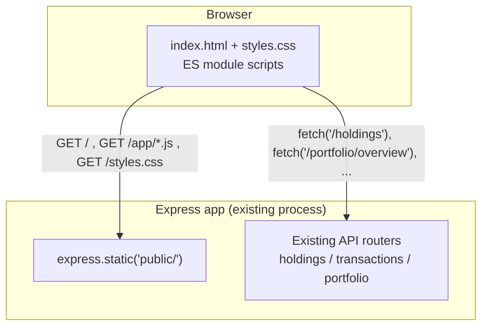
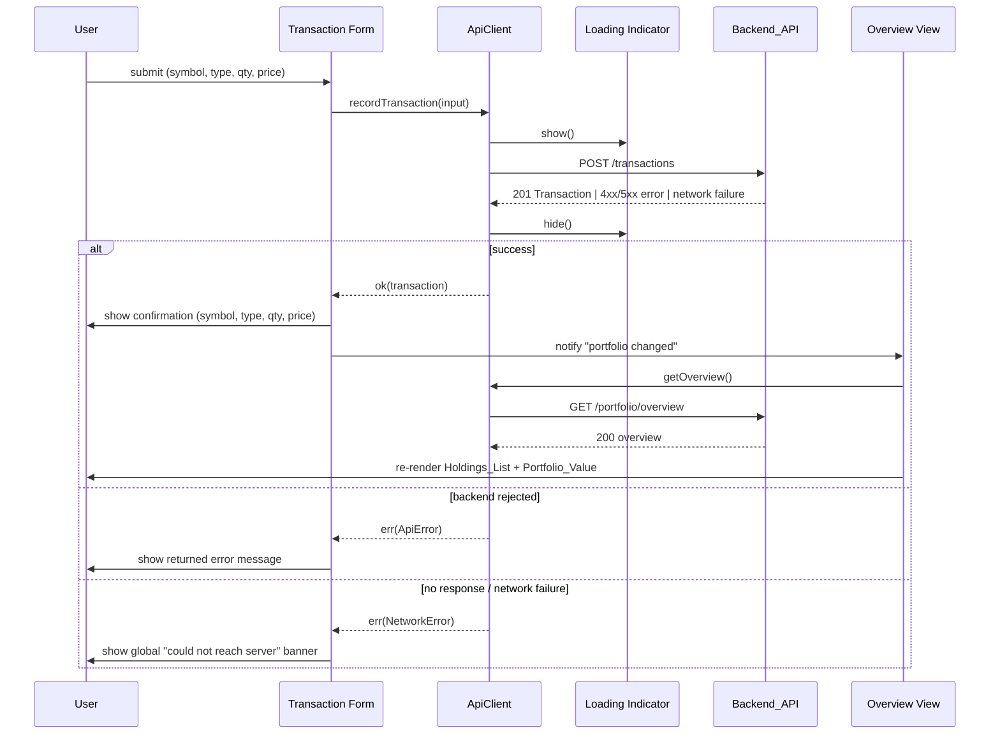

# Design Document

## Overview

This feature adds a browser-based frontend for the Portfolio management capabilities already exposed by the `crypto-portfolio-core` Backend_API. It introduces no new business logic: every rule about what a valid Holding, Transaction, or price looks like, and every computation of Holding_Value or Portfolio_Value, already lives in and is enforced by the Backend_API. The Frontend's entire job is to render what the Backend_API returns, collect and submit what a user enters, and tell the user what happened — including when nothing could be reached at all.

Because the scope is deliberately small (eight requirements, no new domain rules, single user, no auth), the design favors the simplest stack that stays testable and matches the rest of the repository's engineering style, rather than introducing a SPA framework, a bundler, or client-side routing:

- **Plain HTML/CSS + vanilla TypeScript**, compiled to native browser ES modules (no framework, no bundler). The application is one HTML page with a handful of sections; there is no client-side routing, no component tree, and no view library to learn or maintain. TypeScript is kept for the same reason it's used on the backend — the wire contract (string-encoded `Decimal` values, discriminated error codes) is exactly the kind of thing structural typing catches at compile time. See [Frontend tech choice](#frontend-tech-choice).
- **Served as static assets by the existing Express app**, at the same origin and port as the Backend_API. This removes an entire category of concerns (CORS, a configurable base URL, a separate dev server/proxy) that a "simple frontend" has no reason to take on. See [Serving and communication](#serving-and-communication).
- **A single refetch-after-mutation data flow**: after any successful create/update/delete/transaction call, the Frontend re-requests `GET /portfolio/overview` and re-renders the Holdings_List and Portfolio_Value from that response, rather than computing the new state on the client. This mirrors the Backend_API's own "recompute from the authoritative source, don't trust a local derivation" philosophy (see the `crypto-portfolio-core` design's discussion of `PortfolioService`), and it is what keeps Requirements 2-7's "the Frontend SHALL display the resulting/updated/recalculated value" acceptance criteria trivially correct: the values shown are always exactly what the Backend_API just computed.

### Frontend tech choice

The requirements (Introduction: "intentionally scoped to basic functionality") and the eight requirements themselves describe a handful of forms and lists, not a rich interactive UI: an overview table, four small forms (add holding, edit holding, record transaction, price update), a history lookup, and a confirmation prompt. That scope does not need client-side state management, virtual DOM diffing, or routing. Introducing a framework (React, Vue, etc.) would add a build pipeline, a dependency footprint, and concepts (component lifecycle, reactivity) with no corresponding requirement to justify them — the opposite of "keep it simple."

Plain TypeScript compiled straight to browser-native ES modules (`<script type="module">`) avoids even a bundler: every module is a separate `.js` file after compilation, imported by relative path, exactly as authored. The one TypeScript-specific detail this requires is writing import specifiers with an explicit `.js` extension in the *source* `.ts` files (e.g. `import { fetchOverview } from './apiClient.js'`), because the compiler does not rewrite specifiers — it only compiles `.ts` to `.js` file-for-file. This is a one-line convention, not a build step.

## Architecture

The Frontend is served by the same Express process that serves the Backend_API, at the same origin. There is no separate frontend server and no cross-origin request anywhere in the system.



`express.static` is mounted first in the middleware chain (see `src/http/app.ts`), ahead of the API routers. A request for a static asset that doesn't exist falls through (`express.static` calls `next()` on a miss) to the API routers and, if nothing matches there either, to the existing `notFoundHandler`. No existing route path collides with a static asset path, so this ordering is purely a matter of "check the file system fast path first" and does not change behavior for any existing endpoint.

**Request flow (example: recording a transaction and refreshing the view)**



Every mutating view (add/edit/remove holding, record transaction, update price) follows this same shape: submit → `ApiClient` call → on success, notify a small shared "portfolio changed" event → the overview view re-fetches and re-renders. This is the only synchronization mechanism in the app (see [Client-side data flow](#client-side-data-flow)); there is no separate client-held copy of the Holdings_List that individual views mutate in place.

## Components and Interfaces

All frontend source lives under `src/frontend/`, compiled by a dedicated `tsconfig.frontend.json` (browser `lib`, `module`/`target` set for native ES modules, `outDir` pointing at `public/app/`) into static output served from `public/`. `public/index.html` and `public/styles.css` are authored directly, not compiled.

| Module | Responsibility |
|---|---|
| `apiClient.ts` | Every HTTP call to the Backend_API. Owns request timeout/network-failure detection and turns every response into a `Result`-shaped value; no other module calls `fetch` directly. |
| `loadingIndicator.ts` | Shows/hides the single global loading indicator (Req 8.1, 8.2), using a pending-request counter so overlapping requests don't hide it prematurely. |
| `errorPresentation.ts` | Turns an `ApiError`/`NetworkError` into the exact string shown to the user; the one place that knows how backend error bodies map to text. |
| `portfolioEvents.ts` | A minimal pub/sub with one event (`portfolioChanged`) used to tell the overview view to refresh after any other view's mutation succeeds. |
| `views/overviewView.ts` | Renders the Holdings_List and Portfolio_Value (Req 1); renders, per Holding, the edit control (Req 3), remove control (Req 4), and price-update control (Req 7); subscribes to `portfolioChanged`. |
| `views/addHoldingForm.ts` | The new-Holding form (Req 2). |
| `views/transactionForm.ts` | The buy/sell Transaction form (Req 5). |
| `views/transactionHistoryView.ts` | The symbol lookup and Transaction history display (Req 6). |
| `main.ts` | Wires the above together against the DOM once the page loads. No logic of its own beyond composition. |

### ApiClient

```typescript
// apiClient.ts — the only module that calls fetch().

export type ApiResult<T> =
  | { ok: true; value: T }
  | { ok: false; error: ApiError };

/** A response the Backend_API returned and rejected, per its documented error shape. */
export interface ApiError {
  readonly kind: 'ApiError';
  readonly status: number;       // 400 / 404 / 409 / 500, as documented in crypto-portfolio-core
  readonly code: string;         // e.g. "ValidationError", "DuplicateHoldingError"
  readonly message: string;
  readonly field?: string;       // present for ValidationError
}

/** No response was received at all: timeout, DNS failure, connection refused, offline, etc. */
export interface NetworkError {
  readonly kind: 'NetworkError';
}

export const REQUEST_TIMEOUT_MS = 30_000; // Req 8.3

export function getOverview(): Promise<ApiResult<PortfolioOverviewResponse>>;
export function listHoldings(): Promise<ApiResult<{ holdings: HoldingResponse[] }>>;
export function addHolding(input: NewHoldingRequest): Promise<ApiResult<HoldingResponse>>;
export function updateHolding(symbol: string, input: HoldingUpdateRequest): Promise<ApiResult<HoldingResponse>>;
export function removeHolding(symbol: string): Promise<ApiResult<void>>;
export function updatePrice(symbol: string, input: PriceUpdateRequest): Promise<ApiResult<HoldingResponse>>;
export function recordTransaction(input: TransactionRequest): Promise<ApiResult<TransactionResponse>>;
export function getTransactionHistory(symbol: string): Promise<ApiResult<{ transactions: TransactionResponse[] }>>;
```

Every function follows the same template: wrap the `fetch` call in an `AbortController` timed out at `REQUEST_TIMEOUT_MS`, route the call through `loadingIndicator`'s show/hide (Req 8.1, 8.2), and classify the outcome into exactly one of three buckets:

1. **HTTP success** (2xx) → parse the JSON body as the typed response, return `{ ok: true, value }`.
2. **HTTP failure** (the Backend_API's documented error shape, any 4xx/5xx) → parse `{ error: { code, message, field? } }` and return `{ ok: false, error: { kind: 'ApiError', status, ...body.error } }`.
3. **No response at all** — `fetch` rejects (offline, DNS, connection refused) or the `AbortController` fires at 30 s — → return `{ ok: false, error: { kind: 'NetworkError' } }`.

This three-way split is exactly what lets each view handler distinguish "the backend told me why this was rejected" (Req 2.4, 3.5, 4.6, 5.6, 7.5 — display the returned error message) from "the backend was unreachable" (Req 8.3 — display the connectivity banner *in addition to* any view-specific message), without re-deriving that distinction in every view.

### Loading indicator

```typescript
// loadingIndicator.ts

/** Increments the pending count and shows the indicator if it was hidden. */
export function requestStarted(): void;

/** Decrements the pending count and hides the indicator once it reaches zero. */
export function requestFinished(): void;
```

`apiClient.ts` calls `requestStarted()`/`requestFinished()` around every call, in a `finally` so the indicator is always cleared regardless of outcome (Req 8.2). A counter rather than a boolean is what makes this correct when two requests happen to overlap (e.g. the overview refresh after a transaction, kicked off while a slower price-update request is still settling) — the indicator stays visible until *all* in-flight requests finish, and never becomes visible again for a "finish" that isn't the true last one.

### Error presentation

```typescript
// errorPresentation.ts

/** The exact string to show for a rejected request, per Req 2.4/3.5/4.6/5.6/7.5/1.5/6.4. */
export function messageForApiError(error: ApiError): string; // returns error.message, verbatim
export function messageForNetworkFailure(): string;          // fixed copy for Req 8.3
```

`messageForApiError` returns the Backend_API's own `message` unchanged, per the requirements' repeated "display the error message returned by the Backend_API" — the Frontend does not rewrite or generalize backend validation text. `messageForNetworkFailure` is the one message the Frontend itself owns, since by definition no backend response was received to relay.

### Client-side data flow

There is exactly one piece of shared client state: the most recently fetched `PortfolioOverviewResponse`, held by `overviewView.ts` and used only to render the Holdings_List and Portfolio_Value. No other view keeps a copy of it or mutates it directly. Every other view's "successful mutation" handler does two things and nothing else:

1. Render its own immediate feedback (a confirmation, a cleared form, a closed edit row — whichever Requirements 2-7 call for).
2. Publish `portfolioChanged` on `portfolioEvents.ts`.

`overviewView.ts` subscribes once, and its handler is simply "re-run the Req 1 fetch-and-render sequence." This means Requirements 2.3, 3.4, 4.5, 5.4, 5.5, and 7.3/7.4 (all of the "the Frontend SHALL display the resulting/updated Holdings_List/Portfolio_Value" criteria) are satisfied by one code path, not five independent ones that each need to agree on how to patch the list in place — in particular, Req 5.5 ("a Sell to zero removes the Holding from the list") falls out for free, because the Holding is simply absent from the next overview response.

### Holding removal confirmation (Requirement 4)

The confirmation prompt (Req 4.2) is implemented with the browser's native `window.confirm()`, seeded with a message naming the Holding's Cryptoasset symbol (e.g. `Remove holding BTC? This cannot be undone.`). `window.confirm()` blocks until the user answers, is inherently accessible (it's native browser UI, not a custom widget the Frontend would otherwise have to build to the same standard), and maps directly onto the requirement's "confirm/decline" shape: declining (Req 4.4) is simply the confirm call returning `false`, at which point the handler returns without calling `apiClient.removeHolding`.

### Serving and communication

`src/http/app.ts` gains one middleware line, mounted before the existing routers:

```typescript
app.use(express.static(path.join(__dirname, '../../public')));
```

`public/index.html` is served for `GET /`; `public/app/*.js` and `public/styles.css` are served for their respective paths. Because the Frontend is same-origin with the Backend_API, `apiClient.ts` calls relative paths (`fetch('/holdings')`, `fetch('/portfolio/overview')`, ...) directly — there is no base URL to configure, and no CORS headers are needed anywhere in the stack. This is a deliberate consequence of the "serve as static assets from the existing app" decision: it removes an entire class of configuration (and a security surface — a permissive CORS policy) that a separately-hosted frontend would otherwise require.

The frontend build is a separate compile step (`tsc -p tsconfig.frontend.json`) from the existing backend build, run before/alongside `npm run build`, since the two have different `lib`/`target` requirements (DOM vs Node) and different output directories (`public/app/` vs `dist/`).

## Data Models

The Frontend defines no persisted data model of its own — it holds no state beyond what's needed to render the current page, and stores nothing across page loads. It is a typed client over the wire shapes `crypto-portfolio-core` already documents and serializes (see that feature's design, "HTTP layer" and each route module's `serialize*` functions). The types below exist purely to give the Frontend's TypeScript compiler the same shape discipline the backend has, and are kept intentionally identical to what the backend actually sends:

| Type | Shape | Notes |
|---|---|---|
| `HoldingResponse` | `{ symbol: string; quantity: string; currentPrice: string }` | `quantity`/`currentPrice` are decimal strings (e.g. `"0.5"`), never parsed to `number` — the Frontend only displays them or round-trips them back into a form field, and never computes with them, so there is no precision to lose by treating them as opaque strings. |
| `HoldingViewResponse` | `HoldingResponse & { holdingValue: string }` | As returned by the overview endpoint. |
| `PortfolioOverviewResponse` | `{ holdings: HoldingViewResponse[]; portfolioValue: string }` | |
| `TransactionResponse` | `{ id: string; symbol: string; type: 'Buy' \| 'Sell'; quantity: string; pricePerUnit: string; timestamp: string }` | `timestamp` is an ISO 8601 string; displayed via `Date` formatting, not parsed back into a request. |
| `NewHoldingRequest` | `{ symbol: string; quantity: string; currentPrice: string }` | Built directly from the add-Holding form's field values (all `<input>` values are already strings). |
| `HoldingUpdateRequest` | `{ quantity: string; currentPrice: string }` | |
| `PriceUpdateRequest` | `{ currentPrice: string }` | |
| `TransactionRequest` | `{ symbol: string; type: 'Buy' \| 'Sell'; quantity: string; pricePerUnit: string }` | |
| `ApiError` / `NetworkError` | as defined under [ApiClient](#apiclient) | Internal to the Frontend; never sent anywhere. |

No Correctness Properties section follows this one — see [Testing Strategy](#testing-strategy) for why property-based testing does not apply to this feature.

## Correctness Properties

### Property 1: No independent correctness properties apply

This feature introduces no business logic, validation rules, or computations of its own — it only renders and relays what the Backend_API already validates and computes, which is covered by `crypto-portfolio-core`'s 17 correctness properties. There is no pure function or universal input/output relationship owned by this feature to state as a "for all inputs X, property P(X) holds" statement; its correctness is a matter of calling the right endpoint with the right body and rendering what came back, which is verified by the example-based tests described in [Testing Strategy](#testing-strategy). The requirements below are validated indirectly, through the Backend_API's own correctness properties in crypto-portfolio-core; this feature adds no independently-testable property of its own.

**Validates: Requirements 1.1, 2.1, 3.1, 4.1, 5.1, 6.1, 7.1, 8.1**

## Error Handling

The Frontend introduces no new error *conditions* — it only has to recognize and present the ones the Backend_API already defines (see `crypto-portfolio-core`'s Error Handling table and `src/http/errorMapping.ts`), plus the one failure mode that is specific to being a network client of that API.

| Situation | Source | Frontend behavior |
|---|---|---|
| `400 ValidationError` | Backend_API | Display `error.message` (and, where the form has a matching field, associate it with that field) in the submitting view's error area. Form values are retained (Req 2.6, 3.5). |
| `404 NotFoundError` | Backend_API | Display `error.message` in the submitting view's error area. |
| `409 DuplicateHoldingError` / `409 InsufficientQuantityError` | Backend_API | Display `error.message` in the submitting view's error area. |
| `500 PersistenceError` / `500 InternalError` | Backend_API | Display `error.message` in the submitting view's error area — the Frontend does not special-case 500s differently from 400-409; it always shows whatever the Backend_API returned (Req 2.4, 3.5, 4.6, 5.6, 7.5). |
| Request rejected for any reason above | Backend_API | Loading indicator is cleared regardless (Req 8.2), *before* the error is rendered. |
| No response within 30 s, or `fetch` rejects (offline, DNS, connection refused) | Frontend (`apiClient`) | Display the fixed "Backend_API could not be reached" message in a page-level banner, distinct from and in addition to any view-specific error area (Req 8.3). The submitting view's own error area is left as it was — there is no backend message to show there, so it isn't overwritten with one. |
| No Holdings in a successful overview response | Backend_API (empty list, not an error) | Rendered as the Req 1.4 empty-state message, not routed through error handling at all. |
| No Transactions for a symbol | Backend_API (empty list, not an error) | Rendered as the Req 6.3 empty-state message, not routed through error handling at all. |

The distinction between "the request failed" (network) and "the request succeeded but was rejected" (an `ApiError`) is made once, inside `apiClient.ts`, and every view branches on that same `ApiResult` shape — there is no second place in the codebase that has to know how to tell a timeout apart from a 404.

## Testing Strategy

**Correctness Properties do not apply to this feature.** Property-based testing is valuable when there's a pure function or a piece of business logic with universal properties to check across a wide input space (round-trips, invariants, and the like) — that's exactly the role `crypto-portfolio-core`'s domain layer plays, and why its design has 17 such properties. This feature has no business logic of its own: it validates nothing the Backend_API doesn't already validate, computes nothing the Backend_API doesn't already compute, and its correctness is almost entirely "did it call the right endpoint with the right body, and did it render what came back" — API-client plumbing and DOM rendering, not an algorithm with invariants to state as "for all inputs X, property P(X) holds." That's a better fit for targeted unit/integration tests than for property-based tests, per the same PBT-applicability criteria `crypto-portfolio-core` itself uses to justify *its* property tests. Accordingly, this design has no Correctness Properties section, and the testing approach below is entirely example-based.

**Test runner**: the existing Jest setup (`jest.config.js`), extended with `jest-environment-jsdom` so frontend test files can render into a DOM without a browser. Individual frontend test files opt in via the `@jest-environment jsdom` docblock, leaving the existing Node-environment backend tests untouched. `fetch` is mocked with `jest.spyOn(global, 'fetch')` (Node 20 ships a native `fetch`, so no extra HTTP-mocking dependency is needed).

Planned test coverage, organized by module:

- **`apiClient.ts`** (`test/frontend/apiClient.test.ts`): for each function, one test for the 2xx success path, one for a representative 4xx/5xx error body (asserting the returned `ApiError` fields match the response), one for a rejected `fetch` (network failure → `NetworkError`), and one for the 30 s timeout firing (using Jest's fake timers to avoid an actual 30-second test). Also verifies `loadingIndicator.requestStarted`/`requestFinished` are called in matched pairs on every path, including the error paths.
- **`errorPresentation.ts`**: unit tests confirming `messageForApiError` returns the backend message verbatim (no rewriting) and `messageForNetworkFailure` returns the fixed connectivity message.
- **`loadingIndicator.ts`**: unit tests for the pending-counter behavior — indicator shows on the first `requestStarted`, stays visible while a second overlaps, and hides only once every outstanding call has finished (including via `finally` after a rejection).
- **Views** (`overviewView`, `addHoldingForm`, `transactionForm`, `transactionHistoryView`): jsdom-based tests per view, driving it via `@testing-library/dom` (`fireEvent`/`getByRole`, added as a devDependency) against a mocked `apiClient`, covering the concrete scenarios each requirement describes rather than generated input — for example:
  - Add-Holding form: submit with all fields present sends the expected request and clears the form on success (Req 2.1-2.3, 2.5); submit left incomplete cannot be submitted (Req 2.1); a rejected submission shows the backend message and retains the entered values (Req 2.4, 2.6).
  - Overview view: renders every Holding's symbol/quantity/price/Holding_Value and the Portfolio_Value from a sample response (Req 1.2, 1.3); renders the empty-state message and a zero Portfolio_Value for an empty response (Req 1.4); renders the load-failure message on an `ApiError` (Req 1.5); re-renders after a `portfolioChanged` event.
  - Edit/price-update controls: opening the edit control pre-populates the current quantity/price (Req 3.2); a rejected update keeps the form open with the submitted values and shows the message (Req 3.5).
  - Removal control: confirms via a mocked `window.confirm`; declining sends no request and leaves the row unchanged (Req 4.4); confirming sends the deletion request (Req 4.2, 4.3).
  - Transaction history view: renders returned Transactions in the order the backend returned them, oldest first, since ordering itself is the backend's responsibility (Req 6.2); renders the empty-state and error-state messages (Req 6.3, 6.4).
  - Loading indicator integration: a slow mocked `apiClient` call is used to assert the indicator is visible while the promise is pending and hidden once it resolves *or* rejects (Req 8.1, 8.2).
- **Static serving smoke test** (`test/http/staticAssets.test.ts`, alongside the existing `test/http/routes.test.ts` supertest-based tests): a single request for `GET /` returns the Frontend's HTML with a 200, and confirms static serving doesn't shadow or break any existing API route (e.g. `GET /portfolio/overview` still reaches the API router, not a 404 from the static middleware). This is a one-time wiring check, not input-varying behavior, so a single example is sufficient.

**What is intentionally not tested here**: the Backend_API's own validation, computation, and persistence behavior — that's `crypto-portfolio-core`'s property-tested domain layer, and re-testing it from the Frontend would duplicate coverage without adding confidence. Visual layout and CSS are not covered by automated tests; manual review is sufficient for a scope this small.
